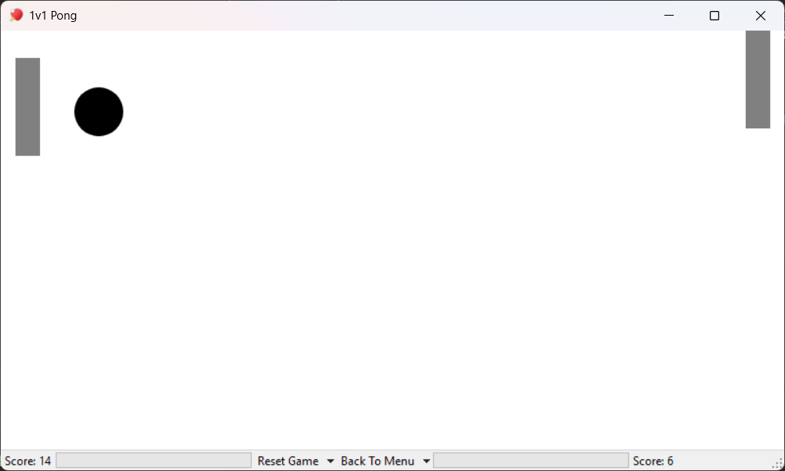

# Pong Game

A Pong game written in C# (WinForms + SkiaSharp) with several game modes.

## Controls
| keys  |      Action       |
|:-----:|:-----------------:|
| W / S | move p1 up / down |
| ↑ / ↓ | move p2 up / down |
|  esc  |  pause the game   |

## Build & run
1. Open `Ball.sln`
2. Restore NuGet packages
3. Run it

Requires Windows and .NET Framework 4.7.2.

## Roadmap
- [x] Sound effects
- [x] Volume slider
- [x] Countdown before the ball starts moving
- [ ] Personal records for single player mode